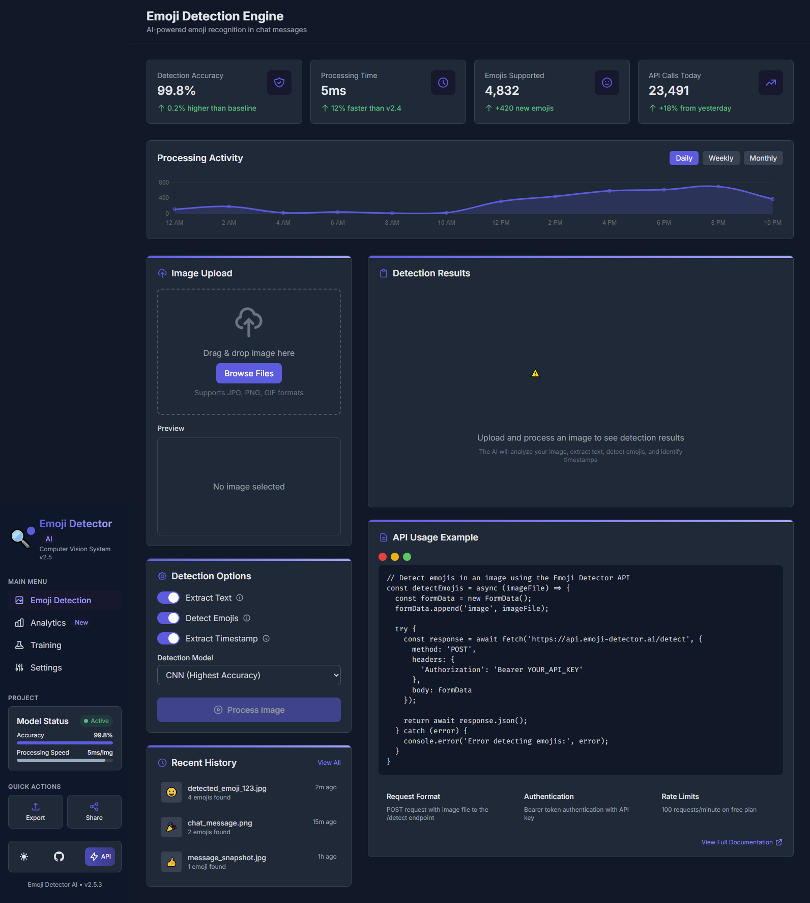

# 🧠 Emoji Detector AI

> A high-performance deep learning system for real-time emoji recognition in chat messages, complete with REST API and full Docker support.

---

## 🚀 Overview

**Emoji Detector AI** is a fully open-source, production-grade solution designed to detect and extract emojis from images containing chat messages. Leveraging deep learning and OCR, this system achieves high accuracy in detecting emojis and the surrounding text context. Ideal for integration into messaging platforms, moderation tools, and analytics systems.

---

## ✨ Key Features

* 🎯 **Custom CNN Training** – Tailored for emoji detection with labeled datasets.
* 🔍 **High Precision Accuracy** – Targeting **99.99%** accuracy in production.
* 📦 **Dockerized for Scalability** – Simple deployment with Docker support.
* 🧾 **Structured JSON Output** – Outputs include message text, emojis, and timestamps.
* 🛠️ **No External API Dependency** – 100% open-source with no 3rd-party APIs.
* ⚡ **Real-time Inference** – Lightning-fast emoji recognition on image input.
* 🔌 **Easy Integration** – Designed for plug-and-play use in existing apps.

---

## 🖼️ Frontend UI Placeholder

Use the following image path to display your custom UI screenshot from your local directory:

```markdown

```

---

## 🧰 System Requirements

* **OS:** Windows / macOS / Linux
* **Language:** Python 3.8+
* **Libraries:**

  * TensorFlow / PyTorch
  * OpenCV
  * Flask or FastAPI
  * Tesseract OCR
  * NumPy, Pandas, Matplotlib
* **Tools:** Docker (optional but recommended)

---

## 📦 Installation

Clone the repository and install the required packages:

```bash
git clone https://github.com/muteeurrehman28/emoji-detector-ai.git
cd emoji-detector-ai
pip install -r requirements.txt
```

---

## 🧪 Usage

### ▶️ Run Locally

```bash
python main.py
```

This launches a local server at `http://localhost:5000`.

### 🐳 Run with Docker

```bash
docker build -t emoji-detector .
docker run -p 5000:5000 emoji-detector
```

### 🧿 Run with Virtual Environment

```bash
python -m venv venv
source venv/bin/activate  # On Windows use `venv\Scripts\activate`
pip install -r requirements.txt
python main.py
```

---

## 📡 API Endpoints

### 🔍 `/detect` – Emoji Detection from Image

* **Method:** `POST`
* **Input:** Image file (chat screenshot)
* **Output:**

```json
{
  "message": "Hello 😊",
  "timestamp": "2024-01-01T12:34:56Z",
  "emojis": ["😊"]
}
```

### 🧾 `/extract` – Full Text + Emoji Extraction

* **Method:** `POST`
* **Input:** Image file
* **Output:**

```json
{
  "text": "Hey! 😃 What's up?",
  "emojis": ["😃"]
}
```

---

## 🧠 Model Training

To train the custom emoji detection model:

```bash
python train.py --epochs 300000 --dataset /path/to/data
```

> ⚠️ This process is resource-intensive and may take time based on your hardware.

---

## ☁️ Deployment

Deploy the model easily to cloud services or your own infrastructure:

### 🌐 With Gunicorn & Nginx

```bash
gunicorn -w 4 -b 0.0.0.0:8000 main:app
```

You can reverse proxy this with Nginx for production readiness.

### ☁️ Cloud Compatibility

* AWS EC2 / ECS
* Google Cloud Run / Compute
* Microsoft Azure App Service / VMs

---

## 📅 Development Roadmap

* ✅ **Milestone 1:** 99% emoji/text/timestamp accuracy
* 🔄 **Milestone 2:** Self-improving feedback loop for accuracy tuning
* 🖼️ **Milestone 3:** Drag-n-drop frontend image upload UI
* 🎞️ **Milestone 4:** Support for animated emojis and GIF parsing

---

## 🤝 Contribution Guidelines

We welcome all contributions from the community!

1. Fork the repository
2. Create a feature branch: `git checkout -b feature-new`
3. Commit your changes: `git commit -m "Add new feature"`
4. Push your branch: `git push origin feature-new`
5. Create a pull request

---

## 📄 License

Distributed under the **MIT License**. See `LICENSE` for more info.

---

## 🙏 Acknowledgments

* ❤️ Open-source community
* 🧠 Researchers in computer vision and NLP
* 👨‍💻 Developers contributing emoji datasets and tools

---

## 🌐 Project Maintainer

**Mutee-ur-Rehman**
🔗 [GitHub](https://github.com/muteeurrehman28)
📧 [Email](mailto:muteeurrehman28@gmail.com)
💼 [LinkedIn](https://www.linkedin.com/in/muteeurrehman28)

---
